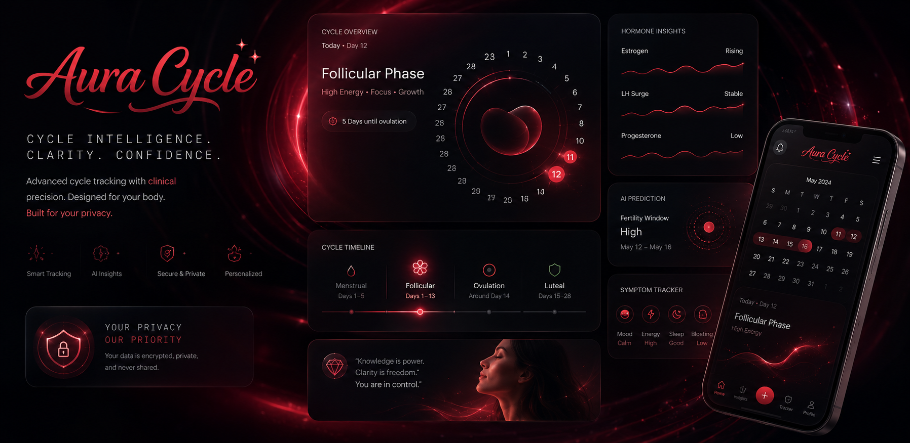

  
  
  
<strong>Clinical Cycle Intelligence & Sexual Health Dashboard</strong>

  
  

    
    
    
  

## Why It Matters

Navigating reproductive health should not require compromising personal data or dealing with convoluted, infantilizing interfaces. **Aura Cycle** was built to provide clinical-grade cycle intelligence with absolute mathematical precision and stunning visualizations.

Whether the goal is to carefully track ovulation, optimize for conception, or manage natural contraception, individuals deserve a tool that is highly rigorous, unequivocally private, and aesthetically brilliant. Aura Cycle leverages strict UTC-based chronobiology algorithms to ensure geographical locale drift never corrupts your fertile window analysis.

---

## Core Features

| Feature | Description |
| :--- | :--- |
| 🩸 **Cycle Intelligence** | Advanced algorithms built on proven ovulatory logic precisely pinpoint fertile windows, phase transitions, and current cycle days. |
| 🧬 **3D Visualizations** | Explore health metrics with high-fidelity 3D data cores and interactive hormone waves (built with React Three Fiber). |
| 📈 **Metric Inspector** | Visualize the fluctuations of key hormones (Estrogen, LH Surge, Progesterone) and analyze personal data over time. |
| 🧘‍♀️ **Daily Logging** | Easily log and monitor daily metrics such as mood, energy levels, sleep quality, and physical symptoms. |
| 🛡️ **Total Privacy** | 100% local execution. Your highly sensitive cycle data is encrypted, private, never shared, and never touches a tracking pixel. |
| 📑 **Offline Exports** | Generate, export, and download highly detailed graphical PDF reports of your cycle history directly to your device. |
| 📚 **Knowledge Base** | Access a secure, localized repository of scientifically-backed reproductive health information and definitions. |
| 🎨 **Premium Aesthetic** | Immersive experience featuring a cinematic preloader, glassmorphism, vibrant dark-mode gradients, and micro-animations. |
| 🌍 **Locale-Agnostic** | Uses pure UTC date modeling to ensure travel and timezone changes don't artificially shift your cycle boundaries. |

 

  
<i>Empowering reproductive autonomy through beautiful, precise software.</i>

  
<small>&copy; 2026 Karthik Lal. All rights reserved.</small>

